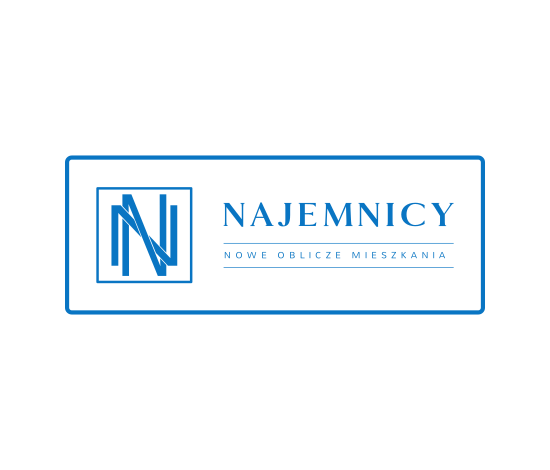

Najemnicy is a web application which helps you rent your dream flat.   
Our app is live and running, [check it!](https://najemnicy.netlify.app/)

# Key Features:

User:
Find apartments in your city,
Filter offers according to selected parameters,
Browse apartment offers,
Add apartments to the favorites list,
Contact the advertiser.

Client:
Add an announcement,
Browse your ads,
Edit ads and change them,
Delete ad,
Read messages from users.

# How To Use:

To clone and run this application, you'll need Git and Node.js (which comes with npm) installed on your computer. From your command line:

# Clone this repository:
$ git clone https://github.com/infoshareacademy/jfdzr6-team-squeezed.git

# Go into the repository:
$ cd jfdzr6-team-squeezed/

# Install dependencies:
$ npm install

# Run the app:
$ npm start

# Tech stack:

[JavaScript](https://www.javascript.com/)
[Node.js](https://nodejs.org/en/)
[React.js](https://reactjs.org/)
[Vite.js](https://vitejs.dev/)
[Firebase](https://firebase.google.com/)

# Authors:

[Michał Tkaczuk](https://github.com/mchltkczk)
[Sylwia Łaboszczak](https://github.com/sylwia-laboszczak)
[Lidia Dalecka](https://github.com/lidia-dalecka)
[Rafał Skiba](https://github.com/rafal-skiba)

# Special thanks to our trainers:

[Dominik Młynarczyk](https://github.com/dominikmlynarczyk)
[Rafał Opacki](https://github.com/RafalOpacki)
[Kamil Richert](https://github.com/krichert)
[Paulina Gumienna](https://github.com/paugumienna)
[Stanislav Lesiuk](https://github.com/stas-lesiuk)
[Józef Piecyk](https://github.com/masives)
[Kamil Wojkowski](https://github.com/wojky)
[Jan Choma](https://github.com/janch11)
